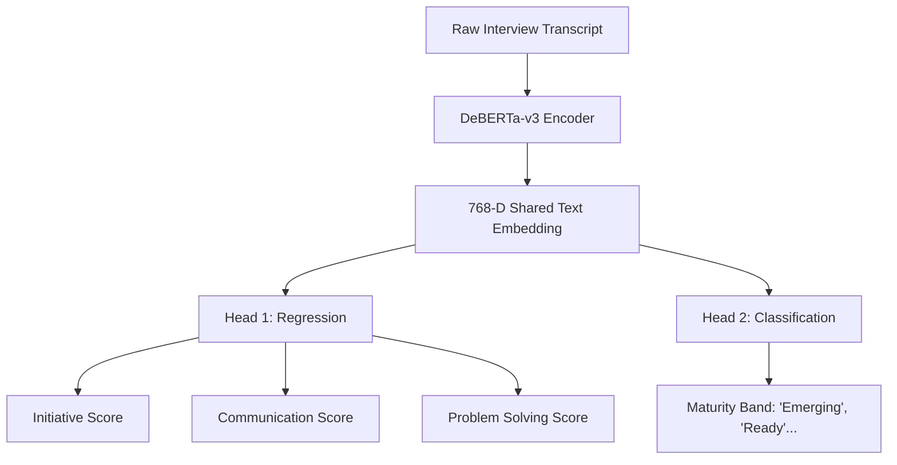
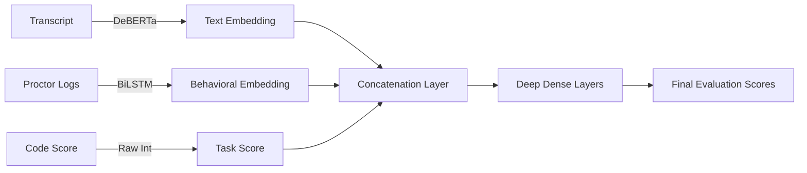

# Deep Learning Architecture Deep Dive

This document outlines the theoretical and architectural foundation of the AI algorithms powering the Intelligent Candidate Recruitment System. It maps platform features to their underlying neural architectures and provides a deep dive into the mechanics of each model.

---

## 1. Feature to Algorithm Mapping

| Platform Feature | Objective | Deep Learning Algorithm | Implementation Technique |
| :--- | :--- | :--- | :--- |
| **Applicant Tracking (ATS)** | Match candidate CVs against Job Descriptions (JDs) | **LLaMA-3.1-Storm-8B** (Causal LLM) | **LoRA** (Low-Rank Adaptation) via PEFT |
| **Interview Scoring** | Extract soft skills and maturity from spoken transcripts | **DeBERTa-v3** (Transformer Encoder) | **Multi-Task Learning (MTL)** with shared encoders |
| **Proctoring Analysis** | Detect cheating and measure behavioral authenticity | **BiLSTM** (Recurrent Neural Network) | **Sequence Modeling** of temporal violation events |
| **Candidate Ranking** | Combine text, behavior, and code scores into a final rank | **MLP Fusion Network** (Feed-Forward) | **Late-Fusion Multimodal Representation Learning** |

---

## 2. Deep Dive: LLaMA-3.1 & LoRA (CV Matching)

**Where it is used:** `backend/dl_ats/model.py`

### The Algorithm
**LLaMA-3.1** is a state-of-the-art decoder-only transformer model. In standard autoregressive text generation, it predicts the next token given a sequence of previous tokens. 

However, loading and fine-tuning an 8-Billion parameter model requires immense computational power. To solve this, the platform utilizes **LoRA (Low-Rank Adaptation)**.

### How LoRA Works
Instead of updating all 8 billion parameters during training, LoRA freezes the pre-trained model weights and injects trainable rank decomposition matrices into the Transformer architecture (specifically the Attention Query and Value projection matrices).

Mathematically, for a pre-trained weight matrix $W_0 \in \mathbb{R}^{d \times k}$, LoRA constrains the update $\Delta W$ by representing it with two smaller matrices $B$ and $A$:
$$W = W_0 + \Delta W = W_0 + BA$$
Where $B \in \mathbb{R}^{d \times r}$ and $A \in \mathbb{R}^{r \times k}$, and the rank $r \ll \min(d, k)$. 

**Why it matters:** This allows the model to learn the highly specific task of parsing CVs and producing structured JSON scores without forgetting its general language understanding, all while running efficiently on standard consumer GPUs.

---

## 3. Deep Dive: DeBERTa-v3 (Interview Analysis)

**Where it is used:** `backend/dl_engine/deberta_scorer.py`

### The Algorithm
**DeBERTa (Decoding-enhanced BERT with disentangled attention)** improves upon standard BERT by utilizing two novel techniques:
1. **Disentangled Attention:** Instead of adding positional encodings directly to word embeddings, DeBERTa uses two vectors for each word (content and position) and computes attention weights based on their disentangled matrices.
2. **Enhanced Mask Decoder:** It incorporates absolute positions in the decoding layer.

### Dataset Integration: Kaggle Feedback Prize & ASAP
To replace generic LLM scoring with scientifically rigorous NLP evaluation, the DeBERTa engine is fine-tuned on Automated Essay Scoring (AES) datasets:
- **Feedback Prize - English Language Learning:** Scores student essays on cohesion, syntax, vocabulary, phraseology, grammar, and conventions. These specific linguistic metrics are mapped algorithmically to our 8 proprietary soft skills (e.g., Syntax + Grammar → Accountability).
- **ASAP (Automated Student Assessment Prize):** Used to assess the depth, maturity, and structural logic of the candidate's answers.

### The Architecture: Multi-Task Learning (MTL)
In your `MultiTaskDeBERTa` architecture, the model does not just predict one thing. It takes a single input (the interview transcript) and branches off into multiple parallel output heads:

**Why it matters:** By sharing the base transformer encoder, the model learns a richer, more generalized understanding of the candidate's language that benefits both the continuous scoring and the categorical maturity classification.

---

## 4. Deep Dive: BiLSTM (Behavioral Authenticity)

**Where it is used:** `backend/dl_engine/bilstm_behavioral.py`

### The Algorithm
A **Bidirectional Long Short-Term Memory (BiLSTM)** network is a specialized Recurrent Neural Network (RNN) designed to process sequential data. Unlike standard RNNs, LSTMs use a system of "gates" (Forget, Input, Output) to prevent the vanishing gradient problem, allowing them to remember long-term dependencies.

### Application to Proctoring
Proctoring violations (e.g., "tab switched at 02:00", "multiple faces at 05:00") are strictly temporal events. A candidate cheating early in the test exhibits a different behavioral signature than one panicking and switching tabs in the last 10 seconds. 

A BiLSTM reads this timeline of events in **both directions** (past-to-future and future-to-past). 
* The **Forward LSTM** understands what led up to a cheating event.
* The **Backward LSTM** understands the aftermath of the event.

By concatenating the hidden states from both directions $\overrightarrow{h_t}$ and $\overleftarrow{h_t}$, the network generates a dense **Behavioral Embedding**. A linear layer then condenses this embedding into a final $0-100$ **Authenticity Score**.

---

## 5. Deep Dive: Multimodal Fusion Network (Decision Engine)

**Where it is used:** `backend/dl_engine/multimodal_fusion.py`

### The Algorithm
Multimodal Learning is the practice of combining data from fundamentally different sources (text, video, tabular) into a single predictive model. Here, the system utilizes a **Late-Fusion Multilayer Perceptron (MLP)**.

### How it Works
The model gathers the latent embeddings extracted by the previous independent models:
1. $E_{text}$ (768 dimensions from DeBERTa)
2. $E_{behavior}$ (256 dimensions from BiLSTM)
3. $S_{task}$ (1 dimension normalized assessment score)

These are concatenated into a single master vector:
$$ V_{master} = [E_{text} \oplus E_{behavior} \oplus S_{task}] $$

This $V_{master}$ is passed through fully connected (dense) layers with ReLU activations and Dropout for regularization. 

**Why it matters:** A candidate might interview brilliantly (high $E_{text}$), but have a suspicious proctoring log (poor $E_{behavior}$). The fusion network learns the complex, non-linear relationships between these factors, mimicking the holistic judgment of an expert human HR recruiter.
